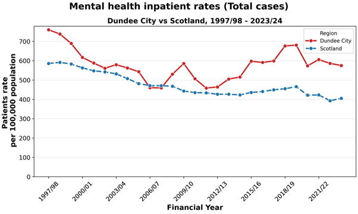
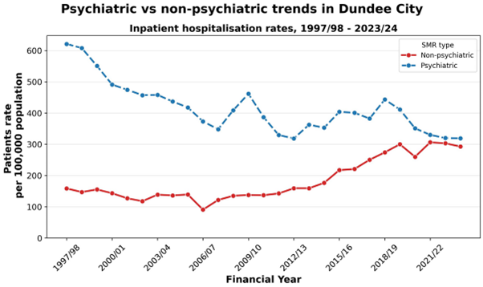

# Investigating Deprivation and Community Intervention in Dundee

Dundee has some of Scotland’s highest rates of child poverty, substance-abuse, and mental health issues, yet it also has hundreds of community support services – many of them poorly signposted, difficult to find, and not listed anywhere accessible. This project examines the first problem by combining spatial mapping, statistical analysis, and interactive dashboards to analyse deprivation and intervention across Dundee and the wider Tay Cities, then begins to address the second by exploring practical community outcomes.

## My Contributions
**Project Management**: Led the overall direction and coordination of the project from initial scoping through to final submission. Responsibilities included facilitating group discussions, maintaining the project timeline, assigning and tracking work across the team, and ensuring all outputs were delivered to a consistent standard.

**Application Prototype Development**: Designed and built the Dundee Recovery Road Map web prototype using open-source tools, with zero-cost deployment in mind. This included developing the Python data pipeline used to clean, geocode, and structure service data for over 400 local services into a JSON dataset powering a live interactive map. The prototype allows users to filter services by day of the week, service type, and target demographic, and was designed to be easily updateable if the underlying dataset is expanded to support long-term sustainability.

**Report Collation and Writing**: Responsible for compiling the final group report, integrating contributions from all six members into a single coherent document, and contributing to framing the report's overall narrative and structure. This included writing connecting and contextual sections including the Background, which draws on SIMD deprivation data, child poverty estimates, NHS Tayside CAMHS waiting time data, and the Dundee ADP Strategic Framework to contextualise our analytical work that follows.

## Contents

- [Project Overview](#project-overview)
  - [Group Members](#group-members)
- [Background](#background)
- [Legal, Social, Ethical, and Professional Issues](#legal-social-ethical-and-professional-issues)
- [Equality, Diversity, and Inclusion Considerations](#equality-diversity-and-inclusion-considerations)
- [Data Sources](#data-sources)
  - [Data Quality Notes](#data-quality-notes)
- [Deprivation](#deprivation)
  - [Child Poverty](#child-poverty)
  - [Mental Health](#mental-health)
    - [Inpatient Hospitalisations in Scotland: Dundee City Focus (1997/98–2023/24)](#inpatient-hospitalisations-in-scotland-dundee-city-focus-199798202324)
  - [Substance Abuse](#substance-abuse)
    - [Alcohol-Related Hospital Admissions in Scotland: Dundee City Focus (1997/98–2023/24)](#alcohol-related-hospital-admissions-in-scotland-dundee-city-focus-199798202324)
- [Intervention](#intervention)
  - [Community Services](#community-services)
    - [Mapping and Analysis of Community Support Service Accessibility and Provision](#mapping-and-analysis-of-community-support-service-accessibility-and-provision)
  - [Prevention and Treatment](#prevention-and-treatment)
    - [Dundee Alcohol & Drug Partnership: Performance Overview 2022–2025](#dundee-alcohol--drug-partnership-performance-overview-20222025)
    - [Local Mental Health Service Performance and Geographical Inequality (2022–2025)](#local-mental-health-service-performance-and-geographical-inequality-20222025)
    - [ADP Framework Analysis: Progress, Risk and Deprivation](#adp-framework-analysis-progress-risk-and-deprivation)
  - [StoryMap Personas](#storymap-personas)
    - [Impact of Accessible Community Services](#impact-of-accessible-community-services)
- [Parish Nursing Dundee](#parish-nursing-dundee)
  - [Stakeholder Engagement and Problem Definition](#stakeholder-engagement-and-problem-definition)
  - [Dundee Recovery Map Prototype](#dundee-recovery-map-prototype)
    - [Overview](#overview)
    - [Looking into the Future](#looking-into-the-future)
    - [Development Process](#development-process)
  - [Recovery Leaflet Re-Design](#recovery-leaflet-re-design)
- [References](#references)

## Project Overview
This project was undertaken as the final group data analysis project for the Women and Future Skills Programme, Dundee (2025-2026), contributing to our SCQF Level 8 Data Science accreditations. Our group of six approached the project with goal to conduct analysis that not only demonstrates the skills we have learned during the programme, but to also provide valuable information to the communities we live and work within. From our initial discussions, we identified Dundee's challenges of child poverty, mental health pressures, and substance-related harm as a focus area.
Our project work comprises two goals: The first is analytical, by using open data to map deprivation, health outcomes, and the reach of intervention programmes across the city. The second is practical, responding to a direct request from Parish Nursing Dundee - a community organisation, to help them rebuild a digital tool that was previously available but became unaffordable to maintain. These two goals are not separate, as the analysis we have conducted provides the evidence base that demonstrates why the tool matters, and the tool itself represents a practical response to the challenges the analysis reveals.
We are a team of women at various stages of retraining and upskilling in data skills. We have tried to approach this work with the same care we would want applied if our own communities were being studied by framing our findings constructively and focusing on what is working and where opportunity lies, and treating the data not as abstract statistics but as descriptions of real people’s lives and experiences.

### Group Members
| Member                | Role             | Responsibilities                                                            | Primary Tools                             |
|-----------------------|------------------|-----------------------------------------------------------------------------|-------------------------------------------|
| Shannon Martin        | Project Manager  | Communication, Data Management, Application Development, and Report Writing | Python, HTML, CSS, JavaScript, GitHub     |
| Fiona Maclean         | Data Lead        | Data Sourcing, Research, Analysis, and Report Writing                       | Excel, Power BI                           |
| Inna Yeromonko        | Excel Lead       | Data Sourcing, Research, Analysis, and Report Writing                       | Excel, Power BI                           |
| Judit Remenyi         | Python Lead      | Data Sourcing, Research, Analysis, Code Documentation, and Report Writing   | Python, Power BI                          |
| Michelle Gallacher    | Research Lead    | Data Sourcing, Research, Analysis, and Report Writing                       | Excel, Power BI                           |
| Roksolana Stefanyshyn | GIS Lead         | Data Sourcing, GIS, Presentation, and Report Writing                        | ArcGIS Online, Canva                      |
> *Table 1: Our project group members and respective roles.*

## Background
Dundee’s challenges are well-documented in data. A briefing note for Dundee City, using the Scottish Index of Multiple Deprivation (SIMD) 2020 data, confirms that 70 out of Dundee’s 188 data zones are ranked within the 20% most deprived in Scotland. The Dundee Poverty Profile 2025 report puts this into perspective by using the data zones ranked within the 20% Most Deprived in the 2020 SIMD along with the 2022 mid-year small area population estimates, to estimate that 54,488 people (36.7%) of those who live in Dundee City live in a data zone ranked within the 20% most deprived. A figure which has risen compared to 53,435 (36.0%) in SIMD 2016.
The impact on children is of particular concern, as End Child Poverty’s 2023/24 estimates (Stone, 2025), found that 7,041 (26.1%) of children in Dundee City were living in poverty after housing costs. This is notably higher than the overall Scottish proportion which stood at 23%, indicating that deprivation is both widespread and being passed down through generations. Pressure on children’s and adolescent’s mental health services adds further concern. NHS Tayside data from Child and Adolescent Mental Health Waiting Times published by Public Health Scotland (2025) show 222 children and young people were awaiting treatment in December 2025, an increase of 20.7% from 184 at the same time in December 2024, reflecting a growing demand on services.
The consequences of sustained poverty are also visible in health data. The Dundee Alcohol and Drug Partnership’s Strategic Framework 2023-2028 notes that nationally, people in the most deprived areas were 15.3 times more likely to die from drug use than those in the least deprived areas. It also states that in Dundee in 2021, more than half of all drug-related deaths occurred in areas of greatest socioeconomic deprivation. National Records of Scotland’s report Drug-related deaths in Scotland, 2024 further confirms that, after adjusting for age, Dundee City had one of the highest rates of drug misuse deaths in Scotland over the period 2020-2024, alongside Glasgow and Inverclyde. 

It was this context that shaped the direction of our project, as these figures raised a practical question:  
**If need is this concentrated and well-documented, how effectively does existing provision respond to it?**  

In exploring this question, along with direct engagement with community organisations, our project’s analytical work examines deprivation, health outcomes, and service reach across Dundee and neighbouring Tay Cities to inform our practical outputs which include up-to-date digital resources to help direct and signpost people in crisis to the support available to them.

## Legal, Social, Ethical, and Professional Issues
Data projects involving sensitive public health and social information carry significant responsibilities. Our project covers child poverty, substance use, and mental health, which are all issues affecting real people, and so our analysis was conducted with care and respect to related legal, social, ethical, and professional considerations.  

Legally, all datasets used are published under the Open Government Licence v3.0 (OGL), permitting free use and adaptation provided the source is acknowledged. Every dataset is recorded in our data source tracker with its licence confirmed before use. No personal or individual-level data is used in this project. All analysis is conducted on data aggregated to datazone, council area, or NHS Board level, ensuring that no individuals can be identified. Where data providers have applied suppression to small counts, we have respected this and acknowledged them as limitations rather than attempting to infer hidden values from surrounding data.  

Socially, the topics that our project investigates, including drug-related deaths, mental health crises, and child poverty are all real, lived experiences, and so our analysis focuses solely on systemic factors: poverty, trauma, inadequate access to service services, and other structural inequalities. It does not focus on individual choices or behaviours, and avoids language or framing that could reinforce any stigma that already surrounds these issues.  

Ethically, we are clear about what our analysis can and cannot claim. Where we identify any relationship between variables, we acknowledge that this is a statistical association, not proof of causation. We also acknowledge that some of our data, including SIMD 2020, is over six years old and may not fully reflect communities that have changed since then. We supplement it with more recent sources where available, including the Dundee Poverty Profile 2025, and Public Health Scotland's most recent publications.  

Professionally, all analysis performed is reproducible. Python notebooks are clean, fully commented, and executable top to bottom. Every statistic and claim in this report is traceable to a cited source in the data source tracker. Code and documents are version-controlled in our shared GitHub project repository. As learners conducting an educational project rather than professional researchers, our recommendations are presented as suggestions for consideration - not definitive policy conclusions, and our findings are reported with appropriate modesty about their scope and authority.

## Equality, Diversity, and Inclusion Considerations
These considerations ask us to reflect on who is represented in our data and analysis, whose voices are absent, and whether our research treats all groups fairly. Our data tells us where deprivation, poor health outcomes, and service gaps are concentrated geographically, but it cannot easily tell us how those experiences differ across gender, ethnicity, disability, or other individual characteristics within the same area. We acknowledge this limitation throughout and do not treat poverty or poor health as uniform experiences. The people most affected by the issues we analyse, including those experiencing poverty, substance use, or mental health crises are not directly present in our analysis. We also note this and recognise that any meaningful, lasting improvement to service provision in Dundee and the other Tay cities will require cooperation with affected communities, not analysis of them alone.  

All our outputs are designed to be accessible, we provide plain-English labels and descriptions throughout all visualisations, along with contextualising statistics so that a member of the public without a data background can easily understand our findings.

## Data Sources
| Dataset | Topic | Source | Time Period | Licence | Geography | Format |
|---------|-------|--------|-------------|---------|-----------|--------|
| [Scottish Index of Multiple Deprivation (SIMD) 2020](https://www.gov.scot/collections/scottish-index-of-multiple-deprivation-2020/) | Deprivation / Child Poverty | Scottish Government | 2020 | OGL v3.0 | Datazone | CSV, Shapefile |
| [Drug-Related Deaths in Scotland](https://www.nrscotland.gov.uk/publications/drug-related-deaths-in-scotland-2024/) | Substance Harm | National Records of Scotland (NRS) | 2000–2023 | OGL v3.0 | Local Authority | Excel (.xlsx) |
| [Drug-Related Hospital Statistics](https://www.opendata.nhs.scot/dataset/drug-related-hospital-statistics-scotland) | Substance Harm / Mental Health | Public Health Scotland | 1996–2025 | OGL v3.0 | NHS Board / Local Authority | CSV |
| [Scotland's Census 2022](https://www.scotlandscensus.gov.uk/2022-reports/) | Population / Demographics | National Records of Scotland (NRS) | 2022 | OGL v3.0 | Datazone | CSV |
| [Data Zone Boundaries 2011](https://www.data.gov.uk/dataset/ab9f1f20-3b7f-4efa-9bd2-239acf63b540/data-zone-boundaries-2011) | GIS | Scottish Government | 2011 | OGL v3.0 | Datazone | CSV, Shapefile |
| [Child Poverty Pathfinders in Dundee and Glasgow: Phase Two Evaluation](https://www.gov.scot/publications/phase-2-evaluation-child-poverty-pathfinders-dundee-glasgow/) | Child Poverty / Early Intervention | Scottish Government | 2022–2025 | OGL v3.0 | Dundee | PDF (Report) |
| [Fairness and Local Child Poverty Plan 2024/25](https://www.dundeecity.gov.uk/sites/default/files/Final%20191-2025%20Fairness%20and%20Local%20Child%20Poverty%20Action%20Plan%20-%20Annual.pdf) | Child Poverty | Dundee City Council | 2024–2025 | OGL v3.0 | Dundee | PDF (Report) |
| [Dundee Poverty Profile 2025](https://www.dundeecity.gov.uk/sites/default/files/Dundee_Poverty_Profile_2025.pdf) | Poverty | Dundee City Council | 2025 | OGL v3.0 | Ward / Local Authority | PDF (Report) |
| [Child and Adolescent Mental Health Services (CAMHS) Waiting Times](https://publichealthscotland.scot/publications/child-and-adolescent-mental-health-services-camhs-waiting-times/child-and-adolescent-mental-health-services-camhs-waiting-times-quarter-ending-september-2025/) | Mental Health | Public Health Scotland | 2025 | OGL v3.0 | NHS Board | PDF (Report) / CSV |
| [Mental Health Inpatient Activity](https://publichealthscotland.scot/publications/mental-health-inpatient-activity/mental-health-inpatient-activity-10-december-2024/data-explorer/) | Mental Health | Public Health Scotland | 1997–2024 | OGL v3.0 | Local Authority / NHS Board | CSV |
| [Alcohol Related Hospital Statistics](https://publichealthscotland.scot/publications/alcohol-related-hospital-statistics/alcohol-related-hospital-statistics-scotland-financial-year-202223/) | Substance Harm / Alcohol Misuse | Public Health Scotland | 2022–2023 | OGL v3.0 | Local Authority / NHS Board | Excel (.xlsx) |
| [Mental Health Services Performance Indicators 2025–26 Quarter 2](https://www.dundeehscp.com/mental-health-services-performance-indicators-2025-26-quarter-2) | Intervention | Dundee Health and Social Care Partnership | 2025–2026 | OGL v3.0 | Dundee | PDF |

> *Table 2: Datasets used or referenced throughout our project.*

### Data Quality Notes
Some statistical disclosure control has been applied to Public Health Scotland datasets to protect patient confidentiality.  
Scottish Index of Multiple Deprivation (SIMD) 2020 is over 6 years old, and so may not fully reflect current deprivation statistics.

## Deprivation

### Child Poverty
Child poverty became one of the main themes in our project because it is closely connected to many of the wider challenges affecting Dundee and the Tay Cities, including deprivation, housing insecurity, mental health pressures, educational inequality, and uneven access to support services. Looking at child poverty gave us a clear way to bring these connected issues together and to show that they should not be treated in isolation. As part of the project, we developed a child poverty dashboard to bring key indicators, local patterns, and regional comparisons into one visual tool. We wanted the dashboard show how child poverty varies by place, how it overlaps with deprivation, and why local context matters when interpreting the figures.
The dashboard brings together several related measures. These include Dundee's child poverty rate after housing costs, child poverty rate before housing costs, absolute child poverty rate before housing costs, and the percentage of children living in the 20% most deprived areas according to the Scottish Index of Multiple Deprivation. It also includes comparison data for Angus, Dundee City, Fife, and Perth and Kinross, alongside ward-level child poverty data for Dundee and trend data showing how rates have changed across the Tay Cities over time.  

These measures were compiled from publicly available national and local sources, including Dundee City Council publications, Dundee poverty profile data, Department for Work and Pensions child poverty statistics, and SIMD-based deprivation data. Bringing these sources together allowed us to move from a single headline figure to a more rounded view of how child poverty is experienced across the area. The dashboard clearly shows that child poverty in Dundee forms part of a wider pattern of inequality rather than being a stand-alone issue. The headline figures show that 26.1% of children in Dundee were living in poverty after housing costs, 18.7% were living in relative poverty before housing costs, 14.8% were living in absolute poverty before housing costs, and 43.4% of children were living in areas ranked within the 20% most deprived SIMD areas. These figures are important for two reasons. First, they show the extent to which housing costs affect the reality of poverty for families. Second, they show that a large proportion of Dundee's children are growing up in neighbourhoods where disadvantage is already concentrated.  

The comparison charts place Dundee within the wider Tay Cities context. They show how Dundee compares with Angus, Fife, and Perth and Kinross, while the ward-level analysis highlights that child poverty is not evenly distributed across the city. In our local dashboard, wards such as Coldside, East End, and Maryfield emerge as areas facing the greatest pressure, while The Ferry and West End show substantially lower levels. The trend view adds a further layer by showing how child poverty rates changed between 2022 and 2025 across the Tay Cities authorities. This helps distinguish between short-term movement in the data and more persistent patterns over time. From a political point of view, this matters because long-term inequality requires a different response from a temporary rise or fall in the figures.  

Taken together, the dashboard functions as an evidence tool rather than just a visual output. It brings together city-wide indicators, regional comparison, and neighbourhood-level analysis in a way that is accessible and practical. More importantly, it supports one of the central points of our project: child poverty should not be understood as a single number in isolation, but as a place-based and multi-dimensional issue shaped by deprivation, family circumstances, housing pressures, health, and access to support.  

> *Figure 1 ArcGIS Dashboard visualising child poverty in Dundee and neighbouring Tay Cities.*

---

### Mental Health
#### Inpatient Hospitalisations in Scotland: Dundee City Focus (1997/98–2023/24)

##### Aim of the analysis
This analysis examines long-term trends in mental health inpatient activity in Scotland, with a specific focus on Dundee City. The main aim is to assess how Dundee compares with Scotland overall and whether differences persist over time.

The analysis also explores:
- Differences between psychiatric and non-psychiatric admissions.
- Dundee’s position relative to other council areas in 2023/24.
- Whether observed patterns are driven by a specific type of inpatient activity or are more general across mental health care.

##### Data and methods

**Data sources**

The analysis used Mental Health Inpatient and Day Case Statistics (MHRHS), covering Scottish general and psychiatric hospitals from financial year 1997/98 to 2023/24.

Although the source dataset includes day cases, this analysis focuses exclusively on inpatient activity.

Patient rates are reported per 100,000 population. Council-level rates are taken directly from the published datasets. Scotland-level rates are derived by averaging age-specific patient rates to provide a consistent national comparator.

Rates are suitable for comparison over time and between areas within Scotland, but they are not directly equivalent to European age-standardised rates.

Two datasets were used:
- Council area–level patient rates by admission type  
- National age- and sex-specific rates, used to derive Scotland-level comparisons  

---

**Data preparation**
- Council area codes were mapped to readable council names.
- Admission types were grouped as:
  - Psychiatric (SMR04)
  - Non-psychiatric (SMR01)
  - Combined (total inpatient activity)
- Quality flag variables and unused fields were removed.
- Data types were checked and standardised.
- Cleaned datasets were exported for reproducibility.

---

**Study design**
- Main comparisons focus on Dundee City versus Scotland.
- Trends were assessed over the full period (1997/98–2023/24).
- Analyses primarily use combined psychiatric and non-psychiatric admissions unless stated otherwise.
- Additional breakdowns examine psychiatric and non-psychiatric trends separately.
- A difference analysis (Dundee minus Scotland) was used to quantify excess inpatient rates.
- A council-level comparison was produced for 2023/24.
- The analysis is descriptive; no statistical modelling was applied.

---

**How Scotland-level and council-level rates were calculated**

Scotland-level rates were calculated from age-specific national data by averaging patient rates across age groups for each year. Council-level rates, including Dundee City, were taken directly from the council-area dataset and averaged where needed within each year.

Both sets of rates:
- Use the same underlying national dataset
- Apply consistent admission definitions
- Cover the same time period

Minor technical differences in aggregation do not affect the overall patterns or conclusions.

##### Results
**Overall trends: all mental health inpatient admissions in Dundee City vs Scotland (Figure 2)**  
Mental health inpatient rates have changed substantially over time in both Dundee City and Scotland. Across the full time period, Dundee City records consistently higher mental health inpatient rates than the Scottish average.
Although rates decline in both Dundee and Scotland over time, the gap between Dundee and the national average persists, indicating a long-standing difference rather than short-term variation. This indicates that Dundee’s higher rates are not driven by short-term fluctuations but reflect longer-standing differences in population need, service use, or both.

> *Figure 2 Mental health inpatient rates (total cases), Dundee City vs Scotland, 1997/98–2023/24.
Standardised patient rates per 100,000 population for total inpatient activity (combining psychiatric and non-psychiatric admissions).*

**Dundee City: psychiatric vs non-psychiatric activity (Figure 3)**
Within Dundee City, both psychiatric and non-psychiatric admissions contribute to overall inpatient activity. Psychiatric admissions show higher and more variable rates over time, while non-psychiatric admissions occur at substantially lower levels and show more modest change.  
Overall trends in Dundee are therefore driven primarily by psychiatric inpatient activity.

> *Figure 3 Psychiatric vs non-psychiatric inpatient rates in Dundee City, 1997/98–2023/24.
Standardised patient rates per 100,000 population for psychiatric and non-psychiatric mental health inpatient admissions in Dundee City.*

### Substance Abuse

#### Alcohol-Related Hospital Admissions in Scotland: Dundee City Focus (1997/98–2023/24)

---

## Intervention
This section looks at what interventions exist across Dundee, how they are distributed relative to need, and what the data says about their effectiveness in reaching people at the most vulnerable points in their lives.

### Community Services
For many people, their journey to recovery starts in a community setting – a food bank, a drop-in chat, or an activity. The graphic below shows how that first contact, when met with support and compassion, can build the trust and routine from which recovery grows.

## Rights & Usage
Group project analysis and visualisations each group member
This repository contains a prototype developed by me as part of a wider group project. No licence is granted for reuse, redistribution, or commercial use of the code or derived datasets without explicit permission.  
The prototype may be shared for non-commercial evaluation or demonstration purposes only.  
© 2026 Shannon Martin. All rights reserved.
